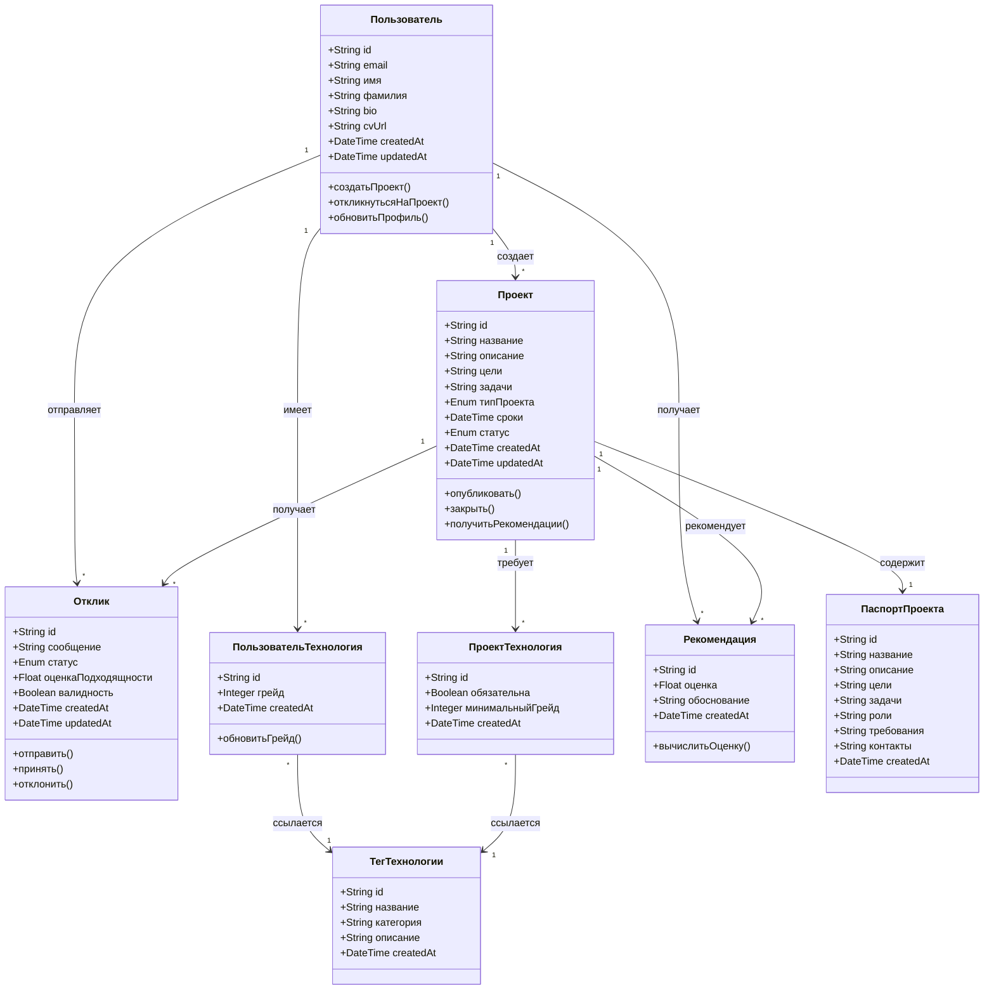

# Модель предметной области (Domain Model)

Модель предметной области описывает основные концепции, сущности и их взаимосвязи в системе StartApp.

## Диаграмма классов предметной области

## Описание сущностей

### Пользователь
Основная сущность системы. Каждый пользователь может:
- Создавать проекты (выступать в роли основателя)
- Откликаться на проекты других (выступать в роли участника)
- Иметь профиль с технологиями и грейдами
- Получать рекомендации проектов

**Атрибуты:**
- `id` — уникальный идентификатор
- `email` — электронная почта (для входа)
- `имя`, `фамилия` — личные данные
- `bio` — краткая биография
- `cvUrl` — ссылка на резюме/CV
- `createdAt`, `updatedAt` — временные метки

### Проект
Представляет публичный проект (учебный или коммерческий), созданный пользователем.

**Атрибуты:**
- `id` — уникальный идентификатор
- `название` — название проекта
- `описание` — подробное описание
- `цели` — цели проекта
- `задачи` — задачи проекта
- `типПроекта` — учебный/коммерческий
- `сроки` — планируемые сроки
- `статус` — активный/закрытый/завершенный

**Связи:**
- Создается одним пользователем (создатель)
- Может получать множество откликов
- Содержит паспорт проекта
- Требует определенные технологии

### Отклик
Представляет отклик пользователя на проект.

**Атрибуты:**
- `id` — уникальный идентификатор
- `сообщение` — сопроводительное сообщение от соискателя
- `статус` — новый/принят/отклонен
- `оценкаПодходящности` — автоматически вычисляемая оценка (0-100)
- `валидность` — соответствует ли кандидат требованиям

**Связи:**
- Отправляется одним пользователем
- Направлен на один проект

### ТегТехнологии
Справочник технологий (React, Node.js, Python и т.д.).

**Атрибуты:**
- `id` — уникальный идентификатор
- `название` — название технологии
- `категория` — фронтенд/бэкенд/база данных/инструменты
- `описание` — краткое описание

### ПользовательТехнология
Связь пользователя с технологией и его уровень (грейд 0-10).

**Атрибуты:**
- `id` — уникальный идентификатор
- `грейд` — уровень знания (0-10)
  - 0 — хочу выучить
  - 1-3 — базовые знания
  - 4-6 — средний уровень
  - 7-9 — продвинутый уровень
  - 10 — углубленное знание

### ПроектТехнология
Связь проекта с требуемой технологией.

**Атрибуты:**
- `id` — уникальный идентификатор
- `обязательна` — обязательна ли технология для проекта
- `минимальныйГрейд` — минимальный требуемый уровень (0-10)

### Рекомендация
Автоматически генерируемая рекомендация проекта для пользователя.

**Атрибуты:**
- `id` — уникальный идентификатор
- `оценка` — оценка релевантности (0-100)
- `обоснование` — объяснение, почему проект рекомендован

### ПаспортПроекта
Детальное описание проекта со всеми требованиями и информацией.

**Атрибуты:**
- `id` — уникальный идентификатор
- `название`, `описание`, `цели`, `задачи` — основная информация
- `роли` — описание ролей в команде
- `требования` — требования к участникам
- `контакты` — контактная информация

## Ключевые ассоциации

1. **Пользователь → Проект (1 ко многим)**
   - Один пользователь может создать множество проектов
   - Каждый проект создан одним пользователем

2. **Пользователь → Отклик (1 ко многим)**
   - Один пользователь может отправить множество откликов
   - Каждый отклик отправлен одним пользователем

3. **Проект → Отклик (1 ко многим)**
   - Один проект может получить множество откликов
   - Каждый отклик направлен на один проект

4. **Пользователь ↔ ТегТехнологии (многие ко многим через ПользовательТехнология)**
   - Пользователь может знать множество технологий
   - Технология может быть известна множеству пользователей
   - Связь содержит грейд (уровень знания)

5. **Проект ↔ ТегТехнологии (многие ко многим через ПроектТехнология)**
   - Проект требует множество технологий
   - Технология может требоваться в множестве проектов
   - Связь содержит требования (обязательность, минимальный грейд)

