# Модель прецедентов (Use Case Model)

Модель прецедентов описывает функциональные требования системы через взаимодействие актеров (пользователей) с системой.

## Взаимосвязь артефактов модели прецедентов

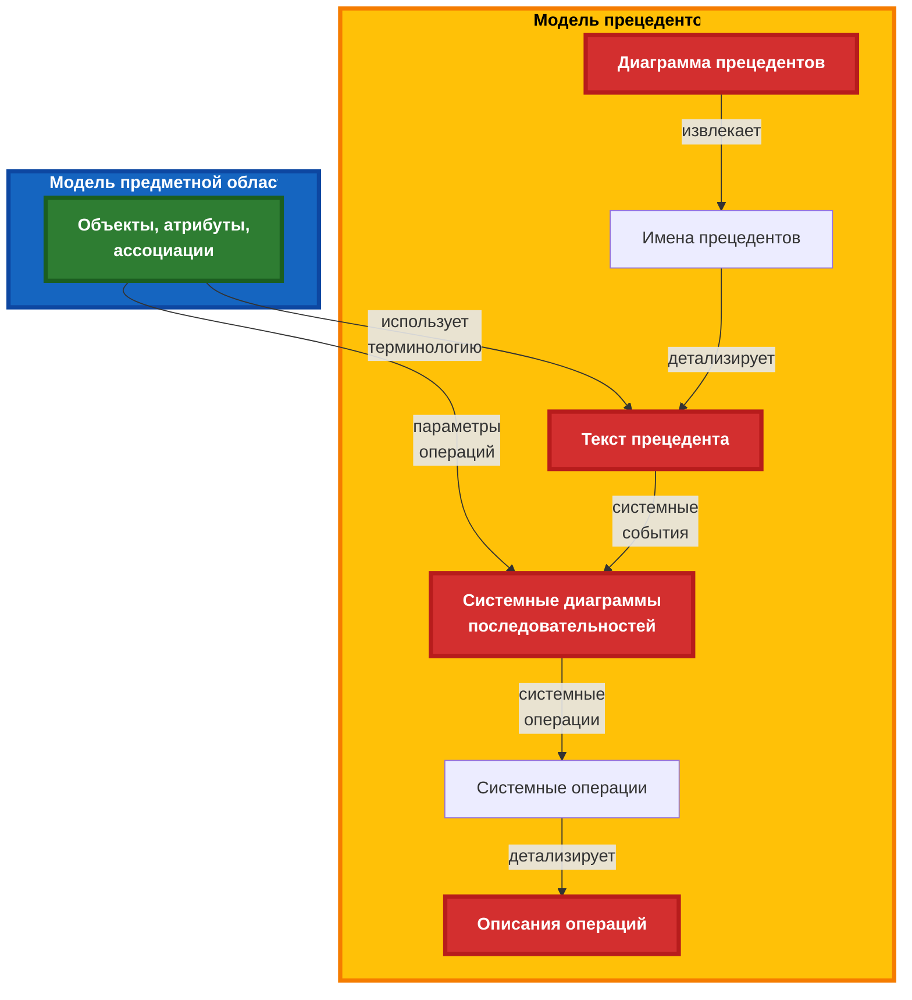

---

## Диаграмма прецедентов

### Основная диаграмма

```mermaid
graph TB
    %% Актеры (крупные, яркие)
    П["👤<br/><b>Пользователь</b>"]
    С["👨‍💼<br/><b>Создатель проекта</b>"]
    У["👥<br/><b>Участник</b>"]
    Р["🤖<br/><b>Система рекомендаций</b>"]
    
    %% Прецеденты (четкие, читаемые)
    UC1["<b>UC1</b><br/>Регистрация и вход"]
    UC2["<b>UC2</b><br/>Создание профиля"]
    UC3["<b>UC3</b><br/>Управление технологиями"]
    UC4["<b>UC4</b><br/>Создание проекта"]
    UC5["<b>UC5</b><br/>Просмотр проектов"]
    UC6["<b>UC6</b><br/>Отклик на проект"]
    UC7["<b>UC7</b><br/>Просмотр откликов"]
    UC8["<b>UC8</b><br/>Оценка кандидата"]
    UC9["<b>UC9</b><br/>Принятие/отклонение"]
    UC10["<b>UC10</b><br/>Получение рекомендаций"]
    UC11["<b>UC11</b><br/>Умный подбор стека"]
    UC12["<b>UC12</b><br/>Просмотр паспорта"]
    
    %% Связи Пользователь
    П --> UC1
    П --> UC2
    П --> UC3
    П --> UC5
    П --> UC10
    П --> UC12
    
    %% Связи Создатель проекта
    С --> UC4
    С --> UC7
    С --> UC8
    С --> UC9
    С --> UC11
    
    %% Связи Участник
    У --> UC6
    
    %% Связи Система рекомендаций (пунктир)
    Р -.->|"автоматически"| UC10
    Р -.->|"автоматически"| UC8
    
    %% Стили - яркие и контрастные
    classDef actorStyle fill:#1565c0,stroke:#0d47a1,stroke-width:5px,color:#ffffff,font-size:15px,font-weight:bold
    classDef usecaseStyle fill:#ffc107,stroke:#f57c00,stroke-width:4px,color:#000000,font-size:14px,font-weight:bold
    
    class P,С,У,Р actorStyle
    class UC1,UC2,UC3,UC4,UC5,UC6,UC7,UC8,UC9,UC10,UC11,UC12 usecaseStyle
```

### Упрощенная диаграмма (по категориям)

Для лучшей читаемости диаграмма разбита на категории:

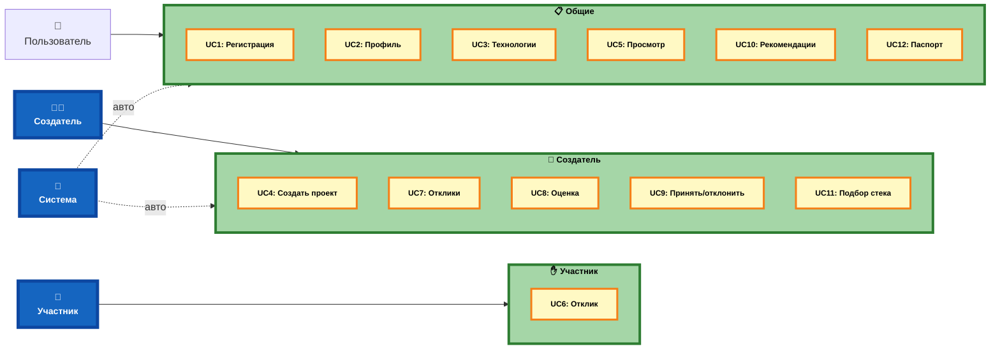

## Структура модели прецедентов

Модель прецедентов включает следующие артефакты:

1. **Диаграмма прецедентов** — высокоуровневое представление актеров и прецедентов
2. **Имена прецедентов** — список всех прецедентов системы
3. **Текст прецедента** — детальное описание каждого прецедента
4. **Системные диаграммы последовательностей** — взаимодействие актеров с системой (система как черный ящик)
5. **Описания операций** — контракты системных операций

---

## Имена прецедентов

- **UC1:** Регистрация и вход
- **UC2:** Создание профиля
- **UC3:** Управление технологиями
- **UC4:** Создание проекта
- **UC5:** Просмотр проектов
- **UC6:** Отклик на проект
- **UC7:** Просмотр откликов
- **UC8:** Оценка кандидата
- **UC9:** Принятие/отклонение отклика
- **UC10:** Получение рекомендаций
- **UC11:** Умный подбор стека
- **UC12:** Просмотр паспорта проекта

---

## Детальное описание прецедентов

### UC1: Регистрация и вход

**Актеры:** Пользователь

**Цель:** Пользователь регистрируется в системе или входит в существующий аккаунт

**Основной поток:**
1. Пользователь открывает страницу регистрации/входа
2. Система отображает форму регистрации/входа
3. Пользователь вводит email и пароль (или использует OAuth)
4. Система проверяет данные
5. Система создает сессию пользователя
6. Пользователь перенаправляется на главную страницу

**Альтернативные потоки:**
- 3a. Пользователь выбирает вход через OAuth (GitHub, Google)
- 4a. Неверные данные — система показывает ошибку

---

### UC2: Создание профиля

**Актеры:** Пользователь

**Цель:** Пользователь создает или редактирует свой профиль

**Основной поток:**
1. Пользователь переходит в раздел "Профиль"
2. Система отображает форму профиля
3. Пользователь заполняет данные:
   - Имя, фамилия
   - Биография
   - Загружает CV (опционально)
4. Пользователь сохраняет профиль
5. Система обновляет данные профиля

**Альтернативные потоки:**
- 3a. Пользователь загружает CV — система сохраняет файл

---

### UC3: Управление технологиями

**Актеры:** Пользователь

**Цель:** Пользователь добавляет технологии в свой профиль с указанием грейда

**Основной поток:**
1. Пользователь переходит в раздел "Мои технологии"
2. Система отображает список технологий и текущие технологии пользователя
3. Пользователь выбирает технологию из списка или добавляет новую
4. Пользователь указывает грейд (0-10)
5. Пользователь сохраняет изменения
6. Система обновляет профиль пользователя

**Альтернативные потоки:**
- 3a. Технологии нет в списке — пользователь может предложить добавить
- 4a. Пользователь может изменить грейд существующей технологии
- 4b. Пользователь может удалить технологию из профиля

---

### UC4: Создание проекта

**Актеры:** Создатель проекта (Пользователь)

**Цель:** Пользователь создает новый публичный проект

**Основной поток:**
1. Пользователь нажимает "Создать проект"
2. Система отображает форму создания проекта
3. Пользователь заполняет паспорт проекта:
   - Название проекта
   - Описание
   - Цели и задачи
   - Тип проекта (учебный/коммерческий)
   - Сроки
   - Выбирает требуемые технологии
   - Указывает роли и требования к участникам
4. Пользователь публикует проект
5. Система создает проект и делает его доступным для просмотра

**Альтернативные потоки:**
- 3a. Для учебного проекта — система предлагает использовать умный подбор стека
- 4a. Пользователь сохраняет как черновик — проект не публикуется

---

### UC5: Просмотр проектов

**Актеры:** Пользователь

**Цель:** Пользователь просматривает список доступных проектов

**Основной поток:**
1. Пользователь открывает страницу "Проекты"
2. Система отображает список проектов с фильтрами
3. Пользователь может:
   - Применить фильтры (тип проекта, технологии, статус)
   - Использовать поиск
   - Сортировать проекты
4. Пользователь выбирает проект для просмотра
5. Система отображает детальную информацию о проекте

**Альтернативные потоки:**
- 3a. Пользователь использует рекомендации — система показывает персональные рекомендации

---

### UC6: Отклик на проект

**Актеры:** Участник (Пользователь)

**Цель:** Пользователь откликается на проект

**Основной поток:**
1. Пользователь просматривает проект
2. Пользователь нажимает "Откликнуться"
3. Система отображает форму отклика
4. Пользователь вводит сопроводительное сообщение (опционально)
5. Пользователь отправляет отклик
6. Система создает отклик и уведомляет создателя проекта

**Альтернативные потоки:**
- 2a. Пользователь уже откликался — система показывает статус отклика
- 5a. Система автоматически вычисляет оценку подходящности

---

### UC7: Просмотр откликов

**Актеры:** Создатель проекта

**Цель:** Создатель проекта просматривает отклики на свой проект

**Основной поток:**
1. Создатель проекта открывает свой проект
2. Создатель проекта переходит в раздел "Отклики"
3. Система отображает список откликов с информацией:
   - Профиль кандидата
   - Оценка подходящности
   - Валидность (соответствие требованиям)
   - Сообщение от кандидата
4. Создатель проекта может сортировать и фильтровать отклики

**Альтернативные потоки:**
- 3a. Система автоматически вычисляет оценку и валидность для каждого отклика

---

### UC8: Оценка кандидата

**Актеры:** Создатель проекта, Система рекомендаций

**Цель:** Система автоматически оценивает кандидата на основе его профиля и требований проекта

**Основной поток:**
1. Система получает отклик от кандидата
2. Система анализирует профиль кандидата:
   - Технологии и грейды
   - CV (если загружено)
   - История проектов
3. Система сравнивает с требованиями проекта:
   - Соответствие технологий
   - Уровень знаний (грейды)
4. Система вычисляет оценку подходящности (0-100)
5. Система определяет валидность (соответствует/не соответствует требованиям)
6. Система сохраняет оценку в отклике

**Альтернативные потоки:**
- 2a. CV не загружено — система использует только теги технологий
- 4a. Для учебного проекта — система учитывает потенциал обучения

---

### UC9: Принятие/отклонение отклика

**Актеры:** Создатель проекта

**Цель:** Создатель проекта принимает или отклоняет отклик кандидата

**Основной поток:**
1. Создатель проекта просматривает отклик
2. Создатель проекта изучает профиль кандидата и оценку
3. Создатель проекта принимает решение:
   - Принять отклик
   - Отклонить отклик
4. Система обновляет статус отклика
5. Система уведомляет кандидата о решении

**Альтернативные потоки:**
- 3a. Создатель проекта может написать сообщение кандидату перед принятием решения

---

### UC10: Получение рекомендаций

**Актеры:** Пользователь, Система рекомендаций

**Цель:** Пользователь получает персональные рекомендации проектов

**Основной поток:**
1. Пользователь открывает раздел "Рекомендации"
2. Система анализирует профиль пользователя:
   - Технологии и грейды
   - CV
   - История проектов
   - Интересы
3. Система находит подходящие проекты:
   - Соответствие технологий
   - Уровень сложности
   - Тип проекта
4. Система вычисляет оценку релевантности для каждого проекта
5. Система сортирует проекты по релевантности
6. Система отображает список рекомендаций с обоснованием

**Альтернативные потоки:**
- 2a. Профиль неполный — система показывает общие рекомендации
- 4a. Система учитывает цели обучения пользователя (грейды 0-3)

---

## Системные диаграммы последовательностей

Системные диаграммы последовательностей показывают взаимодействие актеров с системой как с черным ящиком. Они определяют системные операции (сообщения, которые актер отправляет системе).

### UC4: Создание проекта

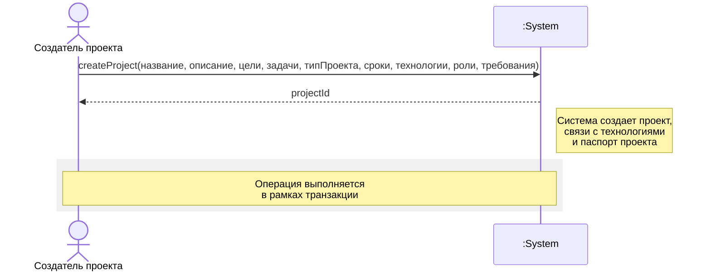

**Системные операции:**
- `createProject(...)` — создание нового проекта

---

### UC6: Отклик на проект

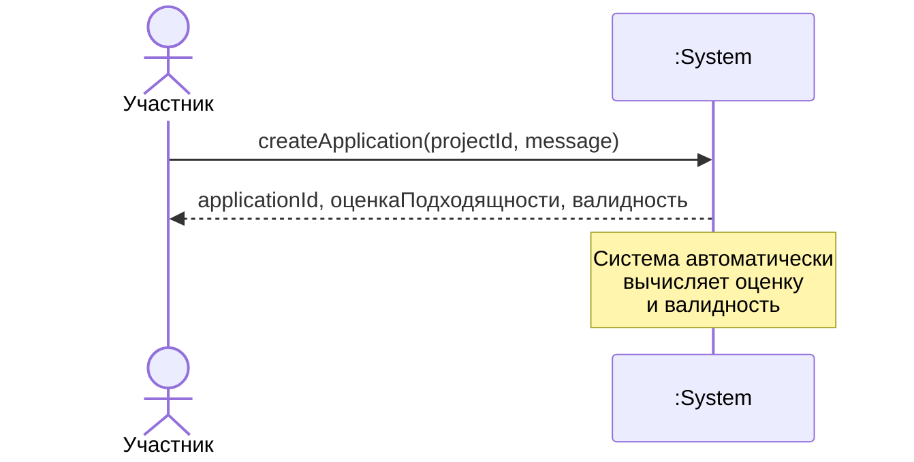

**Системные операции:**
- `createApplication(projectId, message)` — создание отклика на проект

---

### UC7: Просмотр откликов

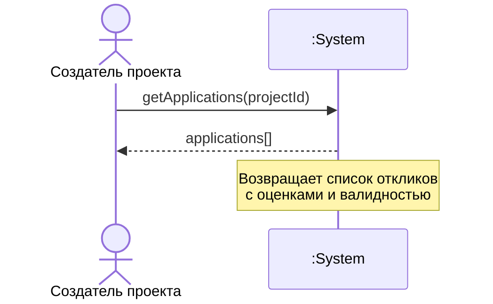

**Системные операции:**
- `getApplications(projectId)` — получение списка откликов на проект

---

### UC9: Принятие/отклонение отклика

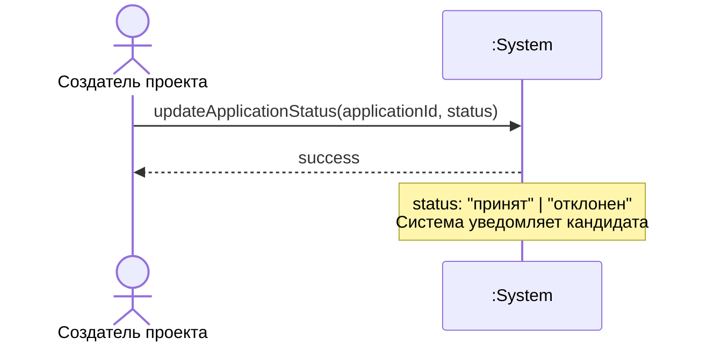

**Системные операции:**
- `updateApplicationStatus(applicationId, status)` — изменение статуса отклика

---

### UC10: Получение рекомендаций

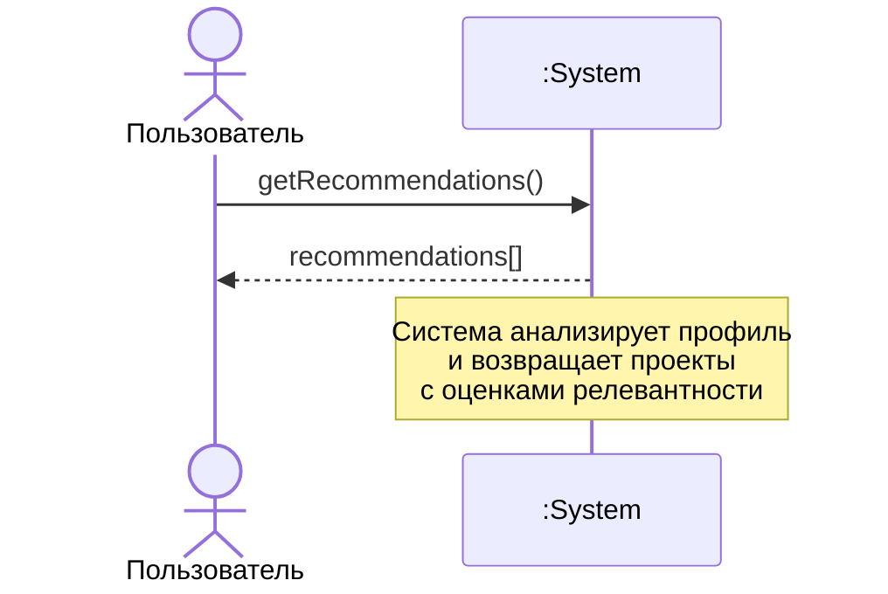

**Системные операции:**
- `getRecommendations()` — получение персональных рекомендаций проектов

---

### UC11: Умный подбор стека

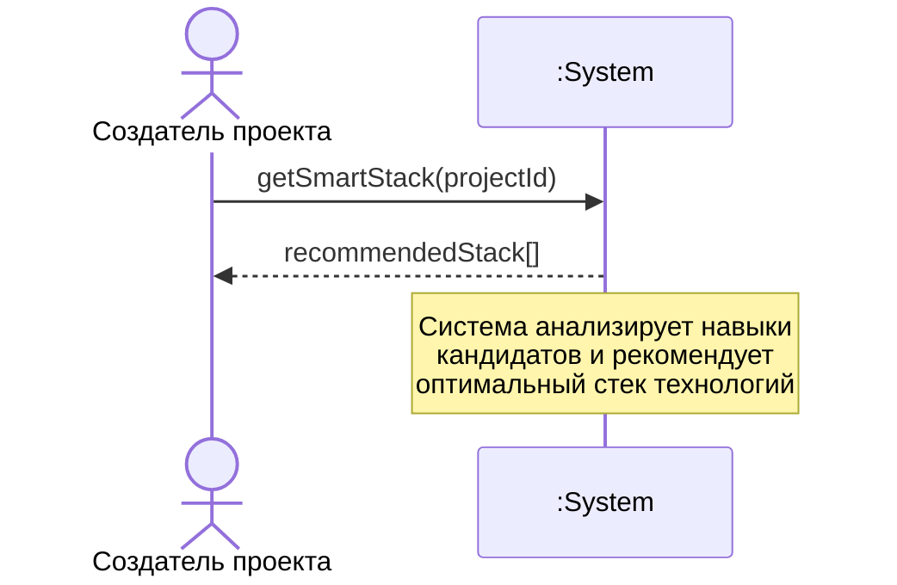

**Системные операции:**
- `getSmartStack(projectId)` — получение рекомендуемого стека технологий для учебного проекта

---

### UC3: Управление технологиями

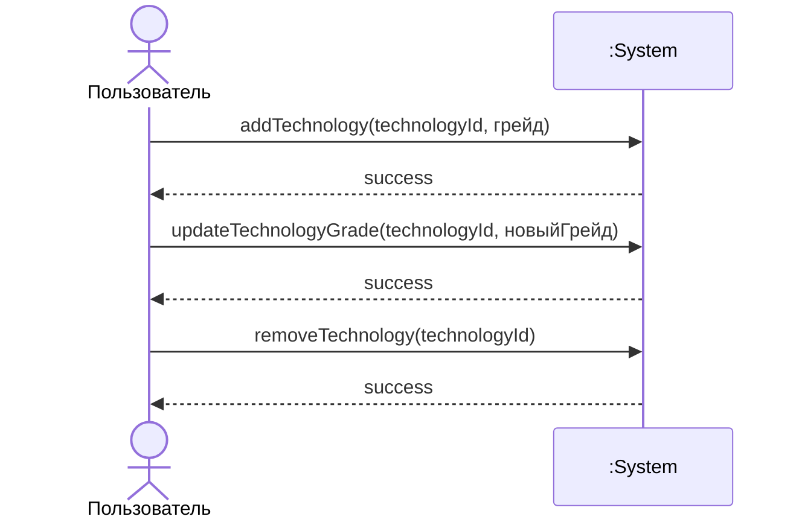

**Системные операции:**
- `addTechnology(technologyId, грейд)` — добавление технологии в профиль
- `updateTechnologyGrade(technologyId, новыйГрейд)` — обновление грейда технологии
- `removeTechnology(technologyId)` — удаление технологии из профиля

---

### UC2: Создание профиля

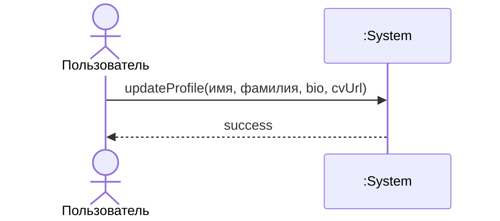

**Системные операции:**
- `updateProfile(имя, фамилия, bio, cvUrl)` — обновление профиля пользователя

---

## Описания операций

Описания операций определяют контракты системных операций — что система гарантирует после выполнения операции.

### Операция: createProject

**Сигнатура:**
```
createProject(
    название: string,
    описание: string,
    цели: string,
    задачи: string,
    типПроекта: "учебный" | "коммерческий",
    сроки: DateTime,
    технологии: Array<{id: string, обязательна: boolean, минимальныйГрейд: number}>,
    роли: string,
    требования: string
): projectId
```

**Постусловия:**
- Создан новый проект в системе
- Проект связан с текущим пользователем (создателем)
- Созданы связи проекта с указанными технологиями
- Создан паспорт проекта с указанными данными
- Проект имеет статус "активный" и доступен для просмотра

---

### Операция: createApplication

**Сигнатура:**
```
createApplication(
    projectId: string,
    message?: string
): {applicationId: string, оценкаПодходящности: number, валидность: boolean}
```

**Постусловия:**
- Создан новый отклик в системе
- Отклик связан с текущим пользователем и указанным проектом
- Вычислена оценка подходящности (0-100) на основе:
  - Соответствия технологий пользователя требованиям проекта
  - Уровней знаний (грейдов) пользователя
- Определена валидность (соответствует ли пользователь обязательным требованиям)
- Создатель проекта уведомлен о новом отклике

**Исключения:**
- `DuplicateApplicationError` — пользователь уже откликался на этот проект
- `ProjectNotFoundError` — проект не найден

---

### Операция: getRecommendations

**Сигнатура:**
```
getRecommendations(): Array<{
    project: Project,
    score: number,
    justification: string
}>
```

**Постусловия:**
- Возвращен список проектов, отсортированный по релевантности
- Для каждого проекта вычислена оценка релевантности (0-100)
- Для каждого проекта сгенерировано обоснование рекомендации
- Рекомендации основаны на:
  - Технологиях и грейдах пользователя
  - CV пользователя (если загружено)
  - Истории проектов пользователя
  - Интересах и целях развития

---

### Операция: calculateMatchScore

**Сигнатура:**
```
calculateMatchScore(
    userId: string,
    projectId: string
): {score: number, validity: boolean}
```

**Постусловия:**
- Вычислена оценка подходящности (0-100) на основе:
  - Процентного соответствия технологий пользователя требуемым технологиям проекта
  - Соответствия грейдов пользователя минимальным требованиям проекта
- Определена валидность:
  - `true` — если пользователь соответствует всем обязательным требованиям
  - `false` — если отсутствует хотя бы одна обязательная технология или грейд ниже требуемого

---

### Операция: getSmartStack

**Сигнатура:**
```
getSmartStack(
    projectId: string
): Array<{
    technology: TechnologyTag,
    reason: string,
    strength: number
}>
```

**Постусловия:**
- Проанализированы навыки всех принятых кандидатов проекта
- Определены наиболее сильные технологии (высокие грейды у многих кандидатов)
- Определены технологии для обучения (низкие грейды, но интерес к изучению)
- Возвращен рекомендуемый стек технологий с обоснованием для каждой технологии
- Стек оптимизирован для баланса силы команды и обучающего потенциала

**Предусловия:**
- Проект имеет тип "учебный"
- На проект есть хотя бы один принятый кандидат

---

### UC11: Умный подбор стека (для учебных проектов)

**Актеры:** Создатель проекта, Система рекомендаций

**Цель:** Для учебного проекта система автоматически подбирает оптимальный стек технологий на основе навыков кандидатов

**Основной поток:**
1. Создатель проекта создает учебный проект
2. Создатель проекта включает опцию "Умный подбор стека"
3. Кандидаты откликаются на проект
4. Система анализирует навыки всех кандидатов:
   - Какие технологии они знают
   - Уровни знаний (грейды)
5. Система определяет наиболее сильный стек:
   - Технологии, в которых кандидаты наиболее компетентны
   - Технологии, которые обеспечат максимальное обучение
6. Система рекомендует стек технологий создателю проекта
7. Создатель проекта может принять или изменить рекомендацию

**Альтернативные потоки:**
- 4a. Кандидатов недостаточно — система ждет больше откликов
- 6a. Система предлагает несколько вариантов стека

---

### UC12: Просмотр паспорта проекта

**Актеры:** Пользователь

**Цель:** Пользователь просматривает детальную информацию о проекте (паспорт проекта)

**Основной поток:**
1. Пользователь открывает проект
2. Система отображает паспорт проекта:
   - Название и описание
   - Цели и задачи
   - Требуемый стек технологий
   - Роли и требования к участникам
   - Тип проекта
   - Сроки
   - Контактная информация
3. Пользователь может просмотреть профиль создателя проекта

**Альтернативные потоки:**
- 2a. Пользователь — создатель проекта — видит дополнительную информацию (статистика откликов)

