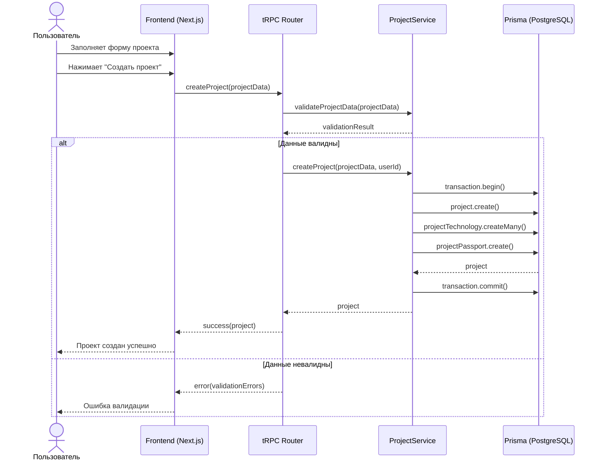
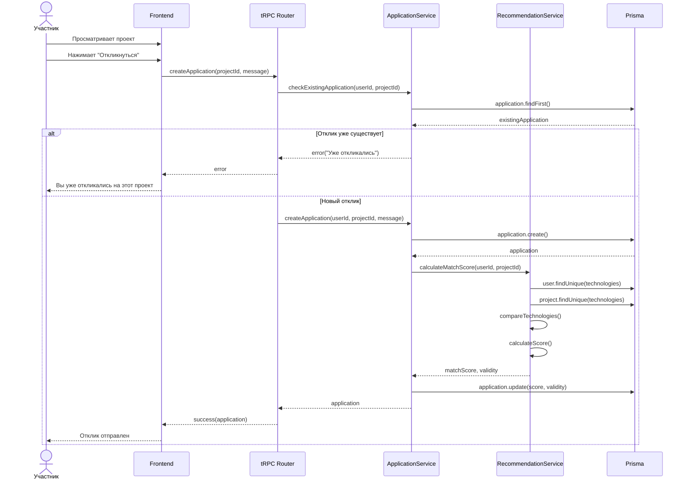
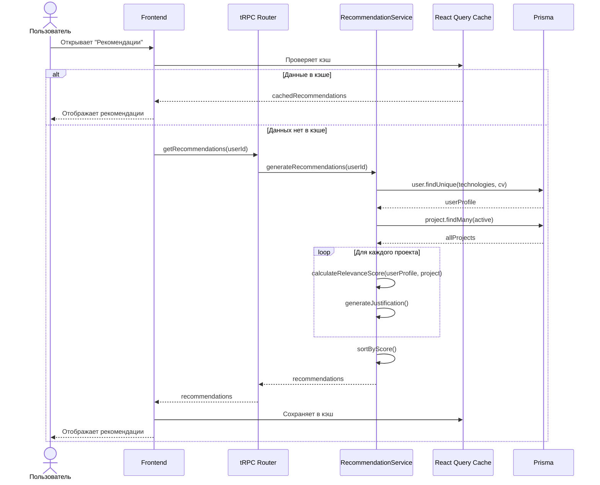
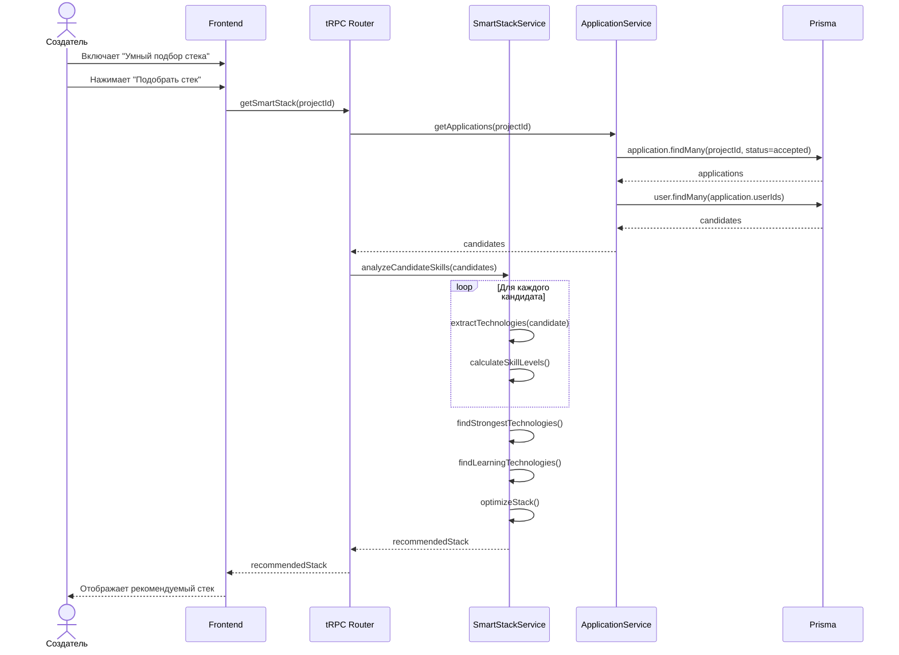
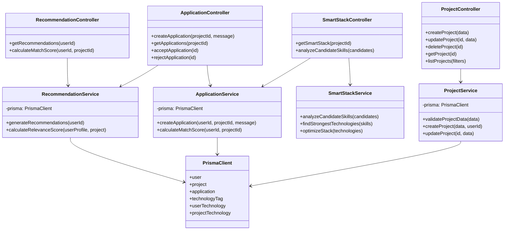

# Модель проектирования (Design Model)

Модель проектирования описывает внутреннюю структуру системы и взаимодействие компонентов при выполнении операций.

## Системные диаграммы последовательностей

### Операция: Создание проекта

### Операция: Отклик на проект

### Операция: Получение рекомендаций проектов

### Операция: Умный подбор стека для учебного проекта

## Диаграмма классов проектирования

## Описание операций

### Операция: createProject

**Входные параметры:**
- `projectData`: {
    - `название`: string
    - `описание`: string
    - `цели`: string
    - `задачи`: string
    - `типПроекта`: "учебный" | "коммерческий"
    - `сроки`: DateTime
    - `технологии`: Array<{id: string, обязательна: boolean, минимальныйГрейд: number}>
    - `роли`: string
    - `требования`: string
  }
- `userId`: string

**Постусловия:**
- Создан новый проект в базе данных
- Проект связан с пользователем (создателем)
- Созданы связи проекта с технологиями
- Создан паспорт проекта
- Проект доступен для просмотра другими пользователями

**Исключения:**
- `ValidationError` — невалидные данные
- `UnauthorizedError` — пользователь не авторизован

---

### Операция: createApplication

**Входные параметры:**
- `projectId`: string
- `message`: string (опционально)
- `userId`: string

**Постусловия:**
- Создан новый отклик в базе данных
- Отклик связан с пользователем и проектом
- Вычислена оценка подходящности
- Определена валидность кандидата
- Создатель проекта уведомлен о новом отклике

**Исключения:**
- `DuplicateApplicationError` — пользователь уже откликался
- `ProjectNotFoundError` — проект не найден

---

### Операция: calculateMatchScore

**Входные параметры:**
- `userId`: string
- `projectId`: string

**Возвращает:**
- `score`: number (0-100) — оценка подходящности
- `validity`: boolean — соответствует ли требованиям

**Алгоритм:**
1. Получить технологии пользователя с грейдами
2. Получить требуемые технологии проекта
3. Для каждой требуемой технологии:
   - Проверить наличие у пользователя
   - Сравнить грейд пользователя с минимальным требуемым
   - Вычислить вклад в общую оценку
4. Учесть обязательные технологии (если отсутствуют — валидность = false)
5. Вернуть итоговую оценку и валидность

---

### Операция: generateRecommendations

**Входные параметры:**
- `userId`: string

**Возвращает:**
- `recommendations`: Array<{
    - `project`: Project
    - `score`: number
    - `justification`: string
  }>

**Алгоритм:**
1. Получить профиль пользователя (технологии, CV, история)
2. Получить все активные проекты
3. Для каждого проекта:
   - Вычислить релевантность (calculateRelevanceScore)
   - Сгенерировать обоснование
4. Отсортировать по убыванию релевантности
5. Вернуть топ-N рекомендаций

---

### Операция: getSmartStack

**Входные параметры:**
- `projectId`: string

**Возвращает:**
- `recommendedStack`: Array<{
    - `technology`: TechnologyTag
    - `reason`: string
    - `strength`: number
  }>

**Алгоритм:**
1. Получить всех принятых кандидатов проекта
2. Извлечь технологии всех кандидатов с грейдами
3. Найти наиболее сильные технологии (высокие грейды у многих кандидатов)
4. Найти технологии для обучения (низкие грейды, но интерес к изучению)
5. Оптимизировать стек для баланса силы и обучения
6. Вернуть рекомендуемый стек с обоснованием

